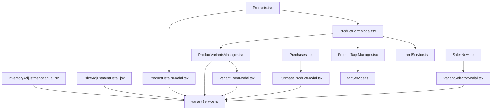

# Gestión de Brands, Tags y Variants: Endpoints y Páginas

Este reporte detalla los endpoints de la API de backend que se utilizan en la aplicación para administrar las marcas (**brands**), etiquetas (**tags**) y variantes (**variants**), además de identificar las vistas (páginas) y componentes específicos que consumen estos servicios.

---

## 1. Endpoints de la API

A continuación se detallan los endpoints utilizados en la aplicación, organizados por recurso, junto con su respectiva definición en los archivos de servicio de [src/services](file:///home/darthrpm/dev/web-project/erp-webapp/src/services).

### Marcas (Brands)
Definido en el servicio [brandService.ts](file:///home/darthrpm/dev/web-project/erp-webapp/src/services/brandService.ts).

| Método HTTP | Endpoint | Descripción | Función del Servicio |
| :--- | :--- | :--- | :--- |
| **GET** | `/api/v1/brands` | Obtiene el listado completo de marcas disponibles. | `getAll()` |
| **POST** | `/api/v1/brands` | Registra una nueva marca. | `create(data)` |

### Etiquetas (Tags)
Definido en el servicio [tagService.ts](file:///home/darthrpm/dev/web-project/erp-webapp/src/services/tagService.ts).

| Método HTTP | Endpoint | Descripción | Función del Servicio |
| :--- | :--- | :--- | :--- |
| **GET** | `/api/v1/tags` | Obtiene todas las etiquetas registradas en el sistema. | `getAll()` |
| **POST** | `/api/v1/tags` | Crea una nueva etiqueta (soporta color, icono y tipo). | `create(data)` |
| **PUT** | `/api/v1/tags/:id` | Modifica una etiqueta existente. | `update(id, data)` |
| **DELETE** | `/api/v1/tags/:id` | Elimina una etiqueta del sistema. | `delete(id)` |
| **GET** | `/products/:productId/tags` | Recupera las etiquetas asignadas a un producto. | `getProductTags(productId)` |
| **POST** | `/products/:productId/tags/:tagId` | Asocia una etiqueta específica a un producto. | `assignToProduct(productId, tagId)` |
| **DELETE** | `/products/:productId/tags/:tagId` | Desasocia una etiqueta de un producto. | `removeFromProduct(productId, tagId)` |

### Variantes (Variants)
Definido en el servicio [variantService.ts](file:///home/darthrpm/dev/web-project/erp-webapp/src/services/variantService.ts).

| Método HTTP | Endpoint | Descripción | Función del Servicio |
| :--- | :--- | :--- | :--- |
| **GET** | `/products/:productId/variants` | Lista las variantes asociadas a un producto específico. | `getVariantsByProductId(...)` |
| **GET** | `/products/:productId/units` | Obtiene la configuración de unidades y precios de un producto. | Usado en `getEnrichedVariants` |
| **GET** | `/api/v1/variants/:id/stock` | Obtiene el stock disponible para una variante (opcionalmente por sucursal). | `getVariantStock(id, branchId)` |
| **POST** | `/products/:productId/variants` | Crea una nueva variante para un producto. | `createVariant(productId, data)` |
| **GET** | `/api/v1/variants/:id` | Obtiene la información detallada de una variante. | `getVariantById(id)` |
| **PUT** | `/api/v1/variants/:id` | Actualiza los datos de una variante. | `updateVariant(id, data)` |
| **DELETE** | `/api/v1/variants/:id` | Elimina una variante. | `deleteVariant(id)` |
| **GET** | `/products/:productId/total-stock` | Obtiene la suma total de stock de todas las variantes del producto. | `getTotalStock(productId, branchId)` |

---

## 2. Componentes y Páginas de Consumo

El consumo de los endpoints anteriores está centralizado mediante los servicios. Abajo se describe dónde se utilizan dentro de la interfaz del ERP:

### Páginas

1. **Catálogo de Productos** — [Products.tsx](file:///home/darthrpm/dev/web-project/erp-webapp/src/pages/Products.tsx)
   - Permite visualizar marcas, etiquetas y variantes al abrir el formulario o detalle de un producto.
   - Integra de forma indirecta los tres servicios a través de sus modales secundarios.

2. **Registro de Compras** — [Purchases.tsx](file:///home/darthrpm/dev/web-project/erp-webapp/src/pages/Purchases.tsx)
   - Utiliza el selector de variantes para añadir productos con especificaciones concretas a una orden de compra.
   - Consume [variantService.ts](file:///home/darthrpm/dev/web-project/erp-webapp/src/services/variantService.ts) de forma indirecta a través del modal de producto de compra.

3. **Punto de Venta (Nueva Venta)** — [SalesNew.tsx](file:///home/darthrpm/dev/web-project/erp-webapp/src/pages/SalesNew.tsx)
   - Consume [variantService.ts](file:///home/darthrpm/dev/web-project/erp-webapp/src/services/variantService.ts) mediante el modal de selección de variante al facturar.

4. **Ajuste Manual de Inventario** — [InventoryAdjustmentManual.jsx](file:///home/darthrpm/dev/web-project/erp-webapp/src/pages/InventoryAdjustmentManual.jsx)
   - Consume directamente [variantService.ts](file:///home/darthrpm/dev/web-project/erp-webapp/src/services/variantService.ts) para cargar y listar las variantes enriquecidas con stock de un producto seleccionado.

5. **Detalle de Ajuste de Precios** — [PriceAdjustmentDetail.jsx](file:///home/darthrpm/dev/web-project/erp-webapp/src/pages/PriceAdjustmentDetail.jsx)
   - Consume directamente [variantService.ts](file:///home/darthrpm/dev/web-project/erp-webapp/src/services/variantService.ts) para obtener variantes y sus precios individuales para aplicar ajustes masivos o específicos.

### Componentes de Soporte

- **Formulario de Producto** — [ProductFormModal.tsx](file:///home/darthrpm/dev/web-project/erp-webapp/src/features/products/components/ProductFormModal.tsx)
  - Carga la lista de marcas para asignación mediante el hook [useProductForm.ts](file:///home/darthrpm/dev/web-project/erp-webapp/src/features/products/hooks/useProductForm.ts).
  - Permite la creación rápida de marcas usando `brandService.create()`.
  - Incrusta el gestor de etiquetas y el gestor de variantes.
- **Detalle del Producto** — [ProductDetailsModal.tsx](file:///home/darthrpm/dev/web-project/erp-webapp/src/features/products/components/ProductDetailsModal.tsx)
  - Muestra marcas e invoca `variantService.getEnrichedVariants()` para renderizar el stock y precios de las variantes asociadas.
- **Gestor de Etiquetas del Producto** — [ProductTagsManager.tsx](file:///home/darthrpm/dev/web-project/erp-webapp/src/features/products/components/ProductTagsManager.tsx)
  - Permite asignar, remover y crear etiquetas para un producto determinado llamando a `tagService.getAll()`, `tagService.getProductTags()`, `tagService.assignToProduct()`, `tagService.removeFromProduct()` y `tagService.create()`.
- **Gestor de Variantes** — [ProductVariantsManager.tsx](file:///home/darthrpm/dev/web-project/erp-webapp/src/features/products/components/ProductVariantsManager.tsx)
  - Muestra el listado de variantes de un producto usando `variantService.getEnrichedVariants()`.
- **Formulario de Variante** — [VariantFormModal.tsx](file:///home/darthrpm/dev/web-project/erp-webapp/src/features/products/components/VariantFormModal.tsx)
  - Crea una variante mediante `variantService.createVariant()`.
- **Selector de Variante en Compras** — [PurchaseProductModal.tsx](file:///home/darthrpm/dev/web-project/erp-webapp/src/features/purchases/components/PurchaseProductModal.tsx)
  - Permite seleccionar una variante específica al cargar un ítem de compra utilizando `variantService.getEnrichedVariants()`.
- **Selector de Variante en Ventas** — [VariantSelectorModal.tsx](file:///home/darthrpm/dev/web-project/erp-webapp/src/features/sales/components/VariantSelectorModal.tsx)
  - Permite al vendedor seleccionar la variante y ver su stock disponible llamando a `variantService.getEnrichedVariants()`.

---

## 3. Diagrama de Relación de Componentes

El siguiente diagrama visualiza cómo fluye la interacción desde las páginas y componentes del ERP hacia los servicios de consumo de la API:

