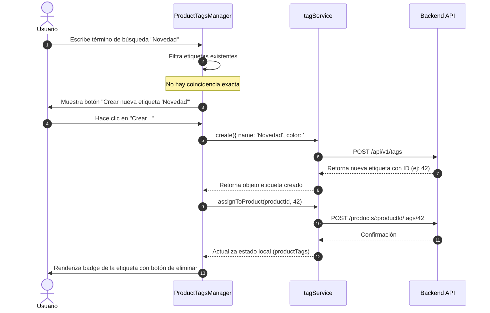

# Implementación y Uso de Etiquetas (Tags)

Este documento describe con detalle técnico la arquitectura, flujo de datos e integración de las etiquetas (**Tags**) en la aplicación.

---

## 1. Arquitectura y Capa de Servicios

La comunicación con el backend para la administración de tags se realiza mediante el cliente de API configurado en [tagService.ts](file:///home/darthrpm/dev/web-project/erp-webapp/src/services/tagService.ts).

### Funcionalidades de la API
El servicio expone las siguientes operaciones principales:

*   **Listado Global**: `getAll()` realiza una petición `GET` a `/api/v1/tags` para obtener todo el catálogo de etiquetas disponibles en el sistema.
*   **Creación**: `create(data)` envía una petición `POST` a `/api/v1/tags` con la estructura `{ name, color, icon, tag_type }`. Las etiquetas creadas desde el catálogo de productos se establecen por defecto con el tipo `GENERAL`.
*   **Edición y Borrado Global**:
    *   `update(id, data)` modifica la metadata global de la etiqueta (`PUT /api/v1/tags/:id`).
    *   `delete(id)` elimina la etiqueta globalmente (`DELETE /api/v1/tags/:id`).
*   **Gestión por Producto**:
    *   `getProductTags(productId)` obtiene solo las etiquetas asociadas a un producto específico (`GET /products/:productId/tags`).
    *   `assignToProduct(productId, tagId)` asocia una etiqueta a un producto (`POST /products/:productId/tags/:tagId`).
    *   `removeFromProduct(productId, tagId)` desasocia una etiqueta de un producto (`DELETE /products/:productId/tags/:tagId`).

---

## 2. Componente de UI: ProductTagsManager

El componente [ProductTagsManager.tsx](file:///home/darthrpm/dev/web-project/erp-webapp/src/features/products/components/ProductTagsManager.tsx) es el núcleo visual e interactivo de la gestión de etiquetas. Está desarrollado en React y proporciona una interfaz fluida basada en los principios de diseño de la aplicación.

### Ciclo de Vida y Estados Internos
Cuando el componente se monta (recibiendo un `productId`), realiza las siguientes acciones:

1.  **Carga Paralela**: Utiliza un `Promise.all` para invocar al mismo tiempo `tagService.getAll()` y `tagService.getProductTags(productId)`. Esto evita llamadas secuenciales lentas (waterfall).
2.  **Búsqueda y Filtrado**: Mantiene un estado local `searchTerm`. Filtra la lista global de etiquetas (`allTags`) basándose en lo que escribe el usuario, comparando cadenas en minúsculas.
3.  **Detección de Coincidencia Exacta**: Evalúa si la etiqueta escrita ya existe globalmente. Si no existe, ofrece la opción dinámica de **"Crear nueva etiqueta"**.
4.  **Generación de Color Estética**: Cuando se crea una nueva etiqueta, el componente selecciona un color de manera aleatoria a partir de una paleta preseleccionada de colores vibrantes y modernos:
    ```typescript
    const colors = ['#0ea5e9', '#8b5cf6', '#ec4899', '#f43f5e', '#f97316', '#eab308', '#10b981', '#14b8a6'];
    ```

### Flujo de Interacción del Usuario
El componente implementa las siguientes acciones de usuario de forma asíncrona:



---

## 3. Integración en Páginas y Modales

Las etiquetas no se configuran de forma aislada, sino dentro de la gestión de catálogo en las siguientes capas de la aplicación:

### 1. Página de Catálogo: [Products.tsx](file:///home/darthrpm/dev/web-project/erp-webapp/src/pages/Products.tsx)
Es la página principal del catálogo de productos. Aunque no gestiona etiquetas de forma directa, contiene el estado del producto seleccionado y abre los modales correspondientes que encapsulan el comportamiento de etiquetas.

### 2. Modal Formulario: [ProductFormModal.tsx](file:///home/darthrpm/dev/web-project/erp-webapp/src/features/products/components/ProductFormModal.tsx)
Dentro de este formulario, la sección de etiquetas tiene un comportamiento condicional basado en el ciclo de vida de creación del producto:

*   **Producto Nuevo**: Si el producto aún no ha sido guardado (no posee un `productId` válido), la sección de etiquetas se deshabilita y muestra el mensaje explicativo:
    > "Guarde el producto primero para habilitar las etiquetas"
*   **Producto Existente**: Cuando se edita un producto con un `productId` activo, se renderiza el componente [ProductTagsManager.tsx](file:///home/darthrpm/dev/web-project/erp-webapp/src/features/products/components/ProductTagsManager.tsx) pasando el ID del producto para habilitar la asignación y creación asíncrona.
