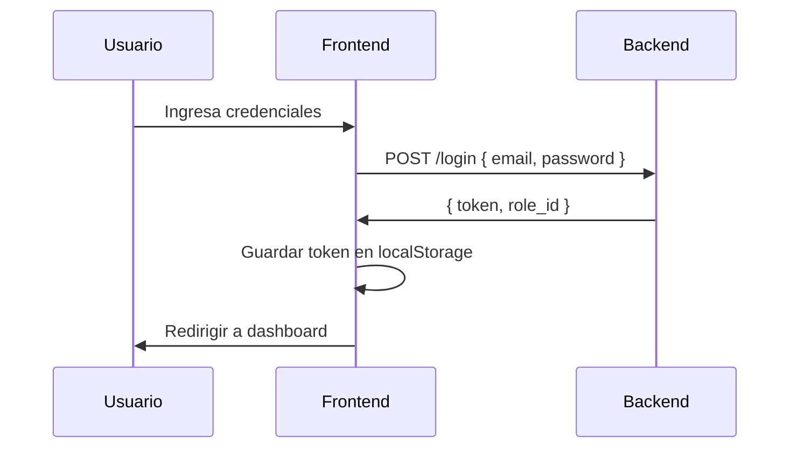
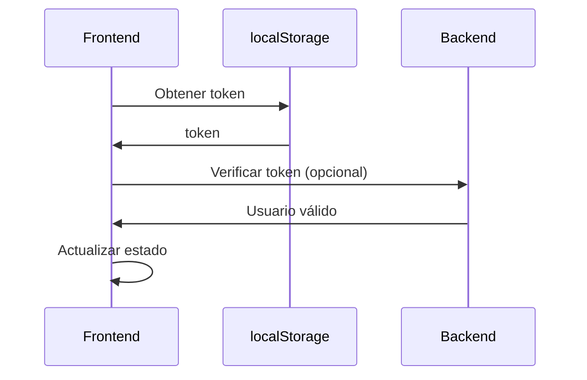

# Integración con API Real - localhost:5050
### 📁 Archivos Modificados

1. **`/src/services/api.### 🔍 Debugging

### Logs de Consola

La aplicación muestra logs detallados en la consola del navegador:

```javascript
// Error de conexión
console.error('Error en login:', error);

// Información de respuesta
console.log('Response:', response);
```

### Manejo de Errores Mejorado

La aplicación ahora proporciona mensajes de error más claros y útiles para los usuarios:

#### **Errores de Autenticación (401)**
- **Mensaje técnico:** "Unauthorized"
- **Mensaje amigable:** "Usuario o contraseña incorrectos. Por favor, verifica tus credenciales e intenta nuevamente."
- **Sugerencias:** Verificar credenciales, comprobar que la cuenta esté activa, recuperar contraseña

#### **Errores de Validación (400)**
- **Mensaje técnico:** "Bad Request"
- **Mensaje amigable:** "Los datos ingresados no son válidos. Asegúrate de completar todos los campos correctamente."
- **Sugerencias:** Verificar campos completos, formato correcto, datos válidos

#### **Errores de Permisos (403)**
- **Mensaje técnico:** "Forbidden"
- **Mensaje amigable:** "Tu cuenta ha sido bloqueada o no tienes permisos para acceder. Contacta al administrador del sistema."
- **Sugerencias:** Contactar administrador, verificar permisos, esperar activación

#### **Errores de Límite de Solicitudes (429)**
- **Mensaje técnico:** "Too Many Requests"
- **Mensaje amigable:** "Demasiados intentos de inicio de sesión. Espera unos minutos antes de intentar nuevamente."
- **Sugerencias:** Esperar tiempo, evitar múltiples intentos, contactar soporte

#### **Errores del Servidor (500)**
- **Mensaje técnico:** "Internal Server Error"
- **Mensaje amigable:** "Error interno del servidor. Nuestro equipo técnico ha sido notificado. Intenta más tarde."
- **Sugerencias:** Esperar, equipo notificado, contactar soporte si es urgente

#### **Errores de Conexión (ECONNREFUSED)**
- **Mensaje técnico:** "Connection refused"
- **Mensaje amigable:** "No se puede conectar al servidor. Verifica tu conexión a internet o contacta al soporte técnico."
- **Sugerencias:** Verificar conexión, comprobar servidor, contactar soporte

### Errores Comunesración base de Axios
2. **`/src/services/authService.js`** - Integración con API real
3. **`/src/store/useAuthStore.js`** - Manejo de `role_id`
4. **`/src/pages/Login.jsx`** - Campo flexible (email o username)

## � Cómo Usar

### 1. Iniciar el Servidor Backend

Asegúrate de que tu servidor esté ejecutándose en `localhost:5050` y que el endpoint `/login` esté disponible y acepte el formato:

```json
{
  "email": "usuario_o_email",
  "password": "contraseña"
}
```

### 2. Iniciar la Aplicación Frontendración de la API

La aplicación ERP ahora está integrada con una API real que debe estar ejecutándose en `localhost:5050`.

### 📋 Endpoint de Autenticación

```
POST http://localhost:5050/login
```

### 📤 Formato de Request

```json
{
  "email": "usuario@ejemplo.com",
  "password": "contraseña123"
}
```

**Nota:** El campo `email` puede contener tanto un email válido como un nombre de usuario. El backend debe manejar ambos casos.

### 📥 Formato de Response Esperado

```json
{
  "token": "eyJhbGciOiJIUzI1NiIsInR5cCI6IkpXVCJ9...",
  "role_id": 1
}
```

## 🔧 Configuración del Frontend

### Variables de Entorno

Crea un archivo `.env` en la raíz del proyecto con:

```env
VITE_API_BASE_URL=http://localhost:5050
VITE_APP_NAME=Sistema ERP
VITE_DEBUG=true
```

### Archivos Modificados

1. **`/src/services/api.js`** - Configuración base de Axios
2. **`/src/services/authService.js`** - Integración con API real
3. **`/src/store/useAuthStore.js`** - Manejo de `role_id`
4. **`/src/pages/Login.jsx`** - Información de API actualizada

## 🚀 Cómo Usar

### 1. Iniciar el Servidor Backend

Asegúrate de que tu servidor esté ejecutándose en `localhost:5050` y que el endpoint `/login` esté disponible.

### 2. Iniciar la Aplicación Frontend

```bash
npm run dev
```

### 3. Probar la Integración

1. Abre la aplicación en el navegador
2. Serás redirigido automáticamente a la página de login
3. Ingresa credenciales válidas (email o username) para tu API
4. El sistema realizará una petición POST a `localhost:5050/login`
5. El frontend enviará `{ "email": "valor_ingresado", "password": "contraseña" }`
6. Si la respuesta es exitosa, serás redirigido al dashboard

**Ejemplos de valores válidos para el campo email:**
- `usuario@ejemplo.com` (email)
- `miusuario` (username)
- `admin` (username)
- `user123` (username)

## 🔍 Debugging

### Logs de Consola

La aplicación muestra logs detallados en la consola del navegador:

```javascript
// Error de conexión
console.error('Error en login:', error);

// Información de respuesta
console.log('Response:', response);
```

### Errores Comunes

### Errores Comunes

#### 1. **Error de Conexión**
```
Error: No se puede conectar al servidor. Verifica tu conexión a internet o contacta al soporte técnico.
```
**Causas posibles:** 
- Servidor backend no ejecutándose
- Problemas de red
- Firewall bloqueando la conexión
**Solución:** Verificar servidor, comprobar conexión, contactar soporte

#### 2. **Credenciales Incorrectas**
```
Error: Usuario o contraseña incorrectos. Por favor, verifica tus credenciales e intenta nuevamente.
```
**Causas posibles:**
- Datos incorrectos
- Cuenta inactiva
- Contraseña cambiada
**Solución:** Verificar credenciales, recuperar contraseña, contactar administrador

#### 3. **Error del Servidor**
```
Error: Error interno del servidor. Nuestro equipo técnico ha sido notificado. Intenta más tarde.
```
**Causas posibles:**
- Problemas en el backend
- Base de datos no disponible
- Configuración incorrecta
**Solución:** Esperar, contactar soporte técnico

#### 4. **Cuenta Bloqueada**
```
Error: Tu cuenta ha sido bloqueada o no tienes permisos para acceder. Contacta al administrador del sistema.
```
**Causas posibles:**
- Cuenta suspendida
- Permisos insuficientes
- Cuenta no activada
**Solución:** Contactar administrador del sistema

#### 5. **Demasiados Intentos**
```
Error: Demasiados intentos de inicio de sesión. Espera unos minutos antes de intentar nuevamente.
```
**Causas posibles:**
- Múltiples intentos fallidos
- Protección anti-brute force
**Solución:** Esperar tiempo de enfriamiento, usar credenciales correctas

## 📊 Flujo de Datos

### 1. Login Process



### 2. Token Verification



## 🛠️ Customización

### Cambiar URL de API

Modifica el archivo `.env`:

```env
VITE_API_BASE_URL=https://mi-api.com
```

### Agregar Más Endpoints

En `authService.js`, puedes agregar más endpoints:

```javascript
// Ejemplo para registro
register: async (userData) => {
  const response = await apiService.post('/register', userData);
  return response;
},

// Ejemplo para logout
logout: async () => {
  await apiService.post('/logout');
  return { message: 'Sesión cerrada' };
}
```

### Manejar Diferentes Roles

El `role_id` se almacena en el store de Zustand:

```javascript
const { user, roleId } = useAuthStore();

// Usar role_id para lógica condicional
if (roleId === 1) {
  // Lógica para admin
} else if (roleId === 2) {
  // Lógica para manager
}
```

## 📱 Headers de Autenticación

El token se envía automáticamente en todas las peticiones:

```javascript
// Interceptor en api.js
apiClient.interceptors.request.use((config) => {
  const token = localStorage.getItem('auth_token');
  if (token) {
    config.headers.Authorization = `Bearer ${token}`;
  }
  return config;
});
```

## 🔒 Seguridad

### Token Storage

- **localStorage** para persistencia
- **Limpieza automática** en errores 401
- **Verificación** al cargar la aplicación

### Error Handling

- **Interceptores** para manejo centralizado
- **Redirección automática** en tokens expirados
- **Mensajes de error** amigables para el usuario

## 📈 Próximos Pasos

1. **Implementar refresh tokens** para mayor seguridad
2. **Agregar más endpoints** (perfil, configuración)
3. **Implementar roles y permisos** granulares
4. **Agregar tests** para la integración
5. **Implementar caching** para optimización
