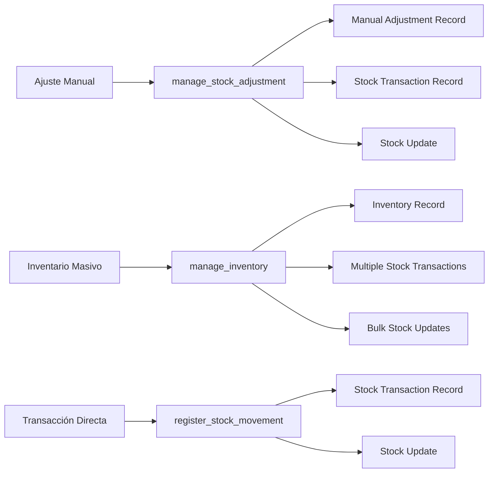

# 🔧 Guía de Desarrollador - Sistema de Inventarios Optimizado

## 🎯 Descripción General

Esta guía está dirigida a desarrolladores que trabajen con el sistema de inventarios y ajustes después de la optimización del 6 de Septiembre 2025. Proporciona las mejores prácticas, patrones de diseño implementados y guías de integración.

**🚀 ÚLTIMA ACTUALIZACIÓN**: `manage_inventory` convertido a FUNCIÓN para consistencia arquitectónica total.

---

## 🚀 Arquitectura Optimizada

### Patrón de Integración Automática

El nuevo sistema implementa el patrón **"Single Source of Truth"** donde:

1. **Un ajuste manual** = **Una transacción de stock automática**
2. **Un inventario masivo** = **Múltiples transacciones de stock automáticas**
3. **Consistencia garantizada** a nivel de base de datos
4. **Auditoría completa** sin código adicional



### Funciones Optimizadas (Nuevo Naming)

| Función Nueva | Tipo | Propósito | Retorna | Uso Recomendado |
|---------------|------|-----------|---------|-----------------|
| `manage_stock_adjustment` | 🔧 FUNCIÓN | Ajustes manuales integrados | `transaction_id` | ✅ **USAR SIEMPRE** para ajustes |
| `manage_inventory` | 🔧 FUNCIÓN | Inventarios masivos integrados | `inventory_id` | ✅ **USAR** para conteos de inventario |
| `register_stock_movement` | 🔧 FUNCIÓN | Transacciones directas | `transaction_id` | ✅ **USAR** para compras/ventas |
| `get_adjustment_history` | 🔧 FUNCIÓN | Historial de ajustes | `table` | ✅ **USAR** para auditoría de ajustes |
| `get_stock_history` | 🔧 FUNCIÓN | Historial de transacciones | `table` | ✅ **USAR** para historial completo |
| `validate_stock_integrity` | 🔧 FUNCIÓN | Validación de consistencia | `table` | ✅ **USAR** para verificaciones |
| `check_system_integrity` | 🔧 FUNCIÓN | Verificación del sistema | `table` | ✅ **USAR** para monitoreo |

---

## 💻 Implementación en Go

### Mejores Prácticas Implementadas

#### 1. Uso de Transacciones Integradas
```go
// ✅ CORRECTO: Usar función integrada para ajustes
func (repo *PostgresRepository) InsertManualAdjustment(ctx context.Context, userId string, adjustment *models.ManualAdjustment) error {
    query := `SELECT products.manage_stock_adjustment($1, $2, $3, $4, $5)`
    // ... implementación retorna transaction_id
}

// ✅ CORRECTO: Usar función integrada para inventarios
func (repo *PostgresRepository) InsertInventory(ctx context.Context, userId string, items []models.InventoryItem) error {
    query := `SELECT products.manage_inventory($1, $2, $3, $4, $5)`
    // ... implementación retorna inventory_id
}

// ❌ INCORRECTO: Manejar manualmente
func (repo *PostgresRepository) BadInsertManualAdjustment(ctx context.Context, userId string, adjustment *models.ManualAdjustment) error {
    // No hacer esto - crear ajuste y transacción por separado
}
```

#### 2. Captura de IDs de Retorno
```go
// ✅ IMPLEMENTADO: Capturar ID para logging y trazabilidad
func (repo *PostgresRepository) InsertInventory(ctx context.Context, userId string, items []models.InventoryItem) error {
    var inventoryID int
    err = repo.db.QueryRowContext(ctx, 
        "SELECT products.manage_inventory($1, $2, $3, $4, $5)", 
        "insert", nil, checkDate, userId, dJson).Scan(&inventoryID)
    
    if err != nil {
        return err
    }
    
    log.Printf("✅ Inventory created successfully with ID: %d", inventoryID)
    return nil
}
```

#### 3. Validación con Context
```go
// ✅ CORRECTO: Siempre usar context
func (p *PostgresRepository) ValidateStockConsistency(ctx context.Context, productID *string) ([]models.StockConsistencyReport, error) {
    query := `SELECT * FROM products.validate_stock_integrity($1)`
    rows, err := p.db.QueryContext(ctx, query, productID)
    // ... manejo con context
}
```

#### 3. Manejo de Errores Estructurado
```go
// ✅ CORRECTO: Errores descriptivos
func (p *PostgresRepository) RegisterStockTransaction(ctx context.Context, userID string, req *models.StockTransactionRequest) (*models.StockTransaction, error) {
    if !models.ValidateTransactionType(req.TransactionType) {
        return nil, fmt.Errorf("tipo de transacción inválido: %s", req.TransactionType)
    }
    
    err = p.db.QueryRowContext(ctx, query, ...).Scan(&transactionID)
    if err != nil {
        return nil, fmt.Errorf("error al registrar transacción: %v", err)
    }
    // ...
}
```

#### 4. Enriquecimiento de Datos
```go
// ✅ IMPLEMENTADO: Enriquecimiento automático
func (p *PostgresRepository) enrichTransactionHistory(ctx context.Context, transaction *models.StockTransactionHistory) {
    // Obtener nombre del producto
    var productName sql.NullString
    err := p.db.QueryRowContext(ctx, "SELECT name FROM products.products WHERE id = $1", transaction.ProductID).Scan(&productName)
    if err == nil && productName.Valid {
        transaction.ProductName = productName.String
    }
    // ...
}
```

---

## 🔧 Patrones de Integración

### 1. Patrón de Ajuste Manual
```typescript
// Frontend Request
const adjustmentRequest = {
    product_id: "PROD_ABC_001",
    new_quantity: 150.50,
    reason: "Conteo físico semanal",
    metadata: {
        source: "physical_count",
        operator: "warehouse_manager",
        verification_method: "double_count"
    }
};

// Backend automáticamente:
// 1. Crea registro en manual_adjustments
// 2. Crea transacción en stock_transactions
// 3. Actualiza stock actual
// 4. Mantiene auditoría completa
// 5. Retorna transaction_id para trazabilidad
```

### 2. Patrón de Inventario Masivo (NUEVO)
```typescript
// Frontend Request para inventario completo
const inventoryRequest = {
    action: "insert",
    check_date: "2025-09-06T12:00:00Z",
    details: [
        {
            product_id: "PROD_ABC_001",
            quantity_checked: 150.50
        },
        {
            product_id: "PROD_DEF_002", 
            quantity_checked: 75.25
        },
        {
            product_id: "PROD_GHI_003",
            quantity_checked: 200.00
        }
    ]
};

// Backend automáticamente:
// 1. Crea registro en inventories
// 2. Crea detalles en inventories_details
// 3. Crea transacciones en stock_transactions para cada producto
// 4. Actualiza stock de todos los productos
// 5. Retorna inventory_id para referencia
```

### 3. Patrón de Transacción Directa
```typescript
// Para compras, ventas, etc.
const transactionRequest = {
    product_id: "PROD_ABC_001",
    transaction_type: "PURCHASE",
    quantity_change: 50.00,
    unit_price: 25.50,
    reference_type: "PURCHASE_ORDER",
    reference_id: "PO_2025_001",
    reason: "Compra semanal",
    metadata: {
        supplier: "SUP_001",
        batch: "B2025090601",
        expiry_date: "2026-09-06"
    }
};
```

### 4. Patrón de Invalidación de Inventario (NUEVO)
```typescript
// Invalidar inventario existente
const invalidationRequest = {
    action: "invalidate",
    inventory_id: 15,
    reason: "Inventario incorrecto"
};

// Backend automáticamente:
// 1. Marca inventario como inválido
// 2. Crea transacciones de corrección
// 3. Revierte cambios de stock
// 4. Mantiene auditoría completa
```

### 3. Patrón de Validación
```typescript
// Validación periódica
const consistencyCheck = await fetch('/stock-transaction/validate-consistency');
const results = await consistencyCheck.json();

// Verificación del sistema
const systemCheck = await fetch('/system/integrity-check');
const systemStatus = await systemCheck.json();
```

---

## 📊 Modelos de Datos Optimizados

### Base Models
```go
// models/manual_adjustment.go
type ManualAdjustment struct {
    ID             int             `json:"id"`
    ProductID      string          `json:"product_id"`
    OldQuantity    int             `json:"old_quantity"`
    NewQuantity    int             `json:"new_quantity"`
    AdjustmentDate time.Time       `json:"adjustment_date"`
    Reason         string          `json:"reason"`
    Metadata       json.RawMessage `json:"metadata"`
    UserID         string          `json:"user_id"`
}

// models/stock_transaction.go
type StockTransaction struct {
    ID              int             `json:"id"`
    ProductID       string          `json:"product_id"`
    TransactionType string          `json:"transaction_type"`
    QuantityChange  float64         `json:"quantity_change"`
    QuantityBefore  float64         `json:"quantity_before"`
    QuantityAfter   float64         `json:"quantity_after"`
    UnitPrice       *float64        `json:"unit_price,omitempty"`
    TotalValue      *float64        `json:"total_value,omitempty"`
    ReferenceType   *string         `json:"reference_type,omitempty"`
    ReferenceID     *string         `json:"reference_id,omitempty"`
    UserID          string          `json:"user_id"`
    TransactionDate time.Time       `json:"transaction_date"`
    Reason          *string         `json:"reason,omitempty"`
    Metadata        json.RawMessage `json:"metadata,omitempty"`
}
```

### Validación de Tipos de Transacción
```go
// models/validation.go
var ValidTransactionTypes = []string{
    "PURCHASE",   // Compra
    "SALE",       // Venta
    "ADJUSTMENT", // Ajuste manual
    "INVENTORY",  // Conteo de inventario
    "INITIAL",    // Stock inicial
    "LOSS",       // Pérdida/merma
    "FOUND",      // Encontrado/sobrante
}

func ValidateTransactionType(transactionType string) bool {
    for _, validType := range ValidTransactionTypes {
        if transactionType == validType {
            return true
        }
    }
    return false
}
```

---

## 🔍 Debugging y Monitoreo

### Logs Estructurados
```go
// Implementar logging estructurado
func (repo *PostgresRepository) InsertManualAdjustment(ctx context.Context, userId string, adjustment *models.ManualAdjustment) error {
    log.Printf("Creating manual adjustment - Product: %s, User: %s, Quantity: %d->%d", 
        adjustment.ProductID, userId, adjustment.OldQuantity, adjustment.NewQuantity)
    
    // ... implementación
    
    log.Printf("Manual adjustment created successfully - ID: %d", adjustment.ID)
    return nil
}
```

### Métricas de Integridad
```go
// Implementar verificación periódica
func (repo *PostgresRepository) PeriodicIntegrityCheck(ctx context.Context) {
    result, err := repo.VerifyAdjustmentStockIntegration(ctx)
    if err != nil {
        log.Printf("Error in integrity check: %v", err)
        return
    }
    
    status := result["integration_status"].(string)
    if status != "OK" {
        log.Printf("ALERT: System integrity issues detected: %+v", result)
        // Enviar alerta a monitoreo
    }
}
```

---

## 🧪 Testing

### Casos de Prueba Esenciales
```go
func TestManualAdjustmentIntegration(t *testing.T) {
    // 1. Crear ajuste manual
    adjustment := &models.ManualAdjustment{
        ProductID:   "TEST_PROD_001",
        NewQuantity: 100,
        Reason:      "Test adjustment",
    }
    
    err := repo.InsertManualAdjustment(ctx, "TEST_USER", adjustment)
    assert.NoError(t, err)
    
    // 2. Verificar que se creó la transacción automáticamente
    transactions, err := repo.GetProductTransactionHistory(ctx, "TEST_PROD_001", 10, 0)
    assert.NoError(t, err)
    assert.Len(t, transactions, 1)
    assert.Equal(t, "ADJUSTMENT", transactions[0].TransactionType)
    
    // 3. Verificar integridad
    integrity, err := repo.VerifyAdjustmentStockIntegration(ctx)
    assert.NoError(t, err)
    assert.Equal(t, "OK", integrity["integration_status"])
}
```

### Performance Testing
```go
func BenchmarkStockOperations(b *testing.B) {
    for i := 0; i < b.N; i++ {
        adjustment := &models.ManualAdjustment{
            ProductID:   fmt.Sprintf("PROD_%d", i),
            NewQuantity: 100,
            Reason:      "Benchmark test",
        }
        repo.InsertManualAdjustment(context.Background(), "BENCH_USER", adjustment)
    }
}
```

---

## 📈 Optimizaciones de Performance

### 1. Índices Recomendados
```sql
-- Ya implementados en el sistema
CREATE INDEX idx_stock_transactions_product_date ON products.stock_transactions(product_id, transaction_date DESC);
CREATE INDEX idx_manual_adjustments_product_date ON products.manual_adjustments(id_product, adjustment_date DESC);
CREATE INDEX idx_stock_transactions_reference ON products.stock_transactions(reference_type, reference_id);
```

### 2. Paginación Eficiente
```go
// ✅ IMPLEMENTADO: Paginación por defecto
func (repo *PostgresRepository) GetProductAdjustmentHistory(ctx context.Context, productID string, limit, offset int) ([]models.ProductAdjustmentHistory, error) {
    // limit y offset aplicados a nivel de base de datos
    query := `SELECT * FROM products.get_adjustment_history($1, $2, $3)`
    // ...
}
```

### 3. Caching de Validaciones
```go
// Recomendación: Implementar cache para validaciones frecuentes
type ValidationCache struct {
    productExists map[string]bool
    userExists    map[string]bool
    mutex         sync.RWMutex
}
```

---

## 🔒 Seguridad

### 1. Validación de Entrada
```go
// ✅ IMPLEMENTADO: Validación estricta
func validateAdjustmentRequest(req *models.ManualAdjustmentRequest) error {
    if req.ProductID == "" {
        return errors.New("product_id es requerido")
    }
    if req.NewQuantity < 0 {
        return errors.New("new_quantity debe ser >= 0")
    }
    if req.Reason == "" {
        return errors.New("reason es requerido")
    }
    return nil
}
```

### 2. Auditoría Completa
```go
// ✅ IMPLEMENTADO: Todas las operaciones son auditadas
// - manual_adjustments table: Registro completo del ajuste
// - stock_transactions table: Transacción asociada automáticamente
// - Triggers de auditoría: Logs automáticos de cambios
```

---

## 📋 Checklist de Implementación

### ✅ Backend (Completado)
- [x] Funciones de base de datos optimizadas
- [x] Naming simplificado y específico  
- [x] Integración automática ajustes-transacciones
- [x] Integración automática inventarios-transacciones
- [x] Consistencia arquitectónica total (todas las funciones)
- [x] Validaciones de consistencia
- [x] Manejo de errores estructurado
- [x] Enriquecimiento de datos automático
- [x] Backend Go actualizado con manage_inventory como función

### 🔄 Frontend (Por Implementar)
- [ ] Interfaces de usuario para ajustes manuales
- [ ] Interfaces de usuario para inventarios masivos
- [ ] Dashboard de consistencia de stock
- [ ] Reportes de discrepancias
- [ ] Historial interactivo de transacciones
- [ ] Alertas de integridad en tiempo real
- [ ] Invalidación de inventarios desde UI

### 🔄 Monitoreo (Recomendado)
- [ ] Alertas automáticas de inconsistencias
- [ ] Métricas de performance
- [ ] Dashboard de estado del sistema
- [ ] Logs centralizados

---

## 🎯 Próximos Pasos Recomendados

1. **Implementar Frontend**: Usar la nueva documentación API
2. **Setup Monitoreo**: Configurar alertas de integridad
3. **Performance Tuning**: Implementar caching si es necesario
4. **Capacitación**: Entrenar al equipo en las nuevas funciones
5. **Testing Integral**: Pruebas end-to-end completas

---

**Última actualización**: 6 de Septiembre de 2025  
**Versión**: 2.1 (Sistema Completamente Optimizado)  
**Estado**: ✅ Backend completamente optimizado + manage_inventory integrado  
**Próximo**: 🚀 Implementación Frontend
