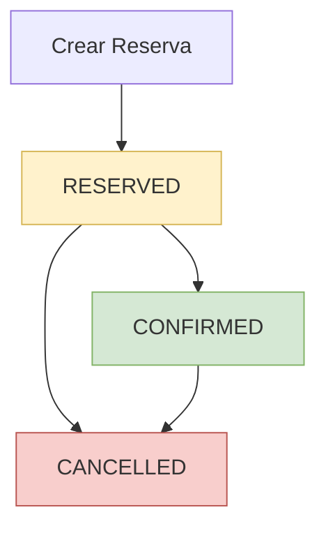

# 📋 Guía de Integración API - Sistema de Reservas

## 🎯 Descripción General

Esta documentación especifica la API del sistema de reservas implementada en el sistema de business management. Proporciona información técnica precisa sobre endpoints, modelos de datos, códigos de respuesta y validaciones basada en la implementación actual del código.

## ⚠️ IMPORTANTE - CAMBIOS RECIENTES

**Última verificación de base de datos:** 6 de Septiembre de 2025

- **✅ Funciones DB corregidas:** Se han resuelto errores críticos en las funciones PostgreSQL
- **✅ Columna `end_time`:** Ahora es auto-generada (NO enviar en requests)
- **✅ Todas las operaciones CRUD:** Verificadas y funcionando correctamente
- **✅ Campo `duration`:** Ahora se llama `duration_hours` en DB pero `duration` en API

---

## 📊 Modelos de Datos

### Reserve
```typescript
interface Reserve {
  id: number;              // ID numérico de la reserva (int64 en DB)
  product_id: string;      // ID del producto reservado
  client_id: string;       // ID del cliente que reserva
  start_time: string;      // Hora inicio (ISO 8601: "2024-01-15T14:00:00Z")
  end_time: string;        // Hora fin (ISO 8601: "2024-01-15T15:00:00Z") - AUTO-GENERADA
  duration: number;        // Duración en horas (int) - se mapea a duration_hours en DB
  total_amount: number;    // Monto total de la reserva (float32)
  status: string;          // Estado: "RESERVED", "CONFIRMED", "CANCELLED"
  user_id: string;         // ID del usuario que creó la reserva (extraído de JWT)
}
```

**⚠️ IMPORTANTE:**
- **`end_time`** es calculado automáticamente por la DB como `start_time + duration_hours`
- **NO enviar `end_time`** en requests de creación/actualización
- **`user_id`** se extrae automáticamente del JWT, no enviarlo en el body
- **Estados válidos:** "RESERVED", "CONFIRMED", "CANCELLED" (case-sensitive)

### ReserveRiched
```typescript
interface ReserveRiched {
  id: number;                    // ID numérico (int64)
  product_id: string;
  product_name: string;          // Nombre del producto (JOIN con products)
  product_description: string;   // Descripción del producto
  client_id: string;
  client_name: string;           // Nombre del cliente (JOIN con clients)
  start_time: string;
  end_time: string;
  duration: number;              // Duración en horas (int)
  total_amount: number;          // Monto total (float32)
  status: string;
  user_id: string;
  user_name: string;             // Nombre del usuario (JOIN con users)
}
```

### ReservationReport
```typescript
interface ReservationReport {
  reserve_id: number;            // ID de la reserva (int)
  product_name: string;          // Nombre del producto
  client_name: string;           // Nombre del cliente
  start_time: string;            // Hora inicio
  end_time: string;              // Hora fin
  duration_hours: number;        // Duración en horas (int)
  total_amount: number;          // Monto total (float64)
  status: string;                // Estado de la reserva
  created_by: string;            // Usuario que creó la reserva
  days_until_reservation: number; // Días hasta la reserva (int)
}
```

### AvailableSchedule
```typescript
interface AvailableSchedule {
  start_time: string;                    // Hora inicio disponible
  end_time: string;                      // Hora fin disponible
  available_consecutive_hours: number;   // Horas consecutivas disponibles (int)
}
```

### ConsistencyIssue
```typescript
interface ConsistencyIssue {
  issue_type: string;       // Tipo de problema de consistencia
  reserve_id?: number;      // ID de reserva afectada (opcional, puede ser null)
  sales_count: number;      // Número de ventas relacionadas (int64)
  details: string;          // Descripción del problema
}
```

### Request Bodies
```typescript
interface ReserveRequest {
  action: string;           // Acción: "create", "update", "cancel"
  reserve_id?: number;      // ID de reserva (int64, REQUERIDO para update/cancel)
  product_id: string;       // ID del producto (REQUERIDO)
  client_id: string;        // ID del cliente (REQUERIDO)
  start_time: string;       // Hora inicio ISO 8601 (REQUERIDO)
  duration: number;         // Duración en horas (int, REQUERIDO)
}
```

**⚠️ VALIDACIONES IMPORTANTES:**
- **NO incluir** `end_time` en el request (auto-generado)
- **NO incluir** `user_id` en el request (extraído del JWT)
- **`reserve_id`** es OBLIGATORIO para actions "update" y "cancel"
- **`action`** valores válidos: "create", "update", "cancel"
- **`start_time`** debe ser formato ISO 8601 válido
- **`duration`** debe ser entero positivo ≥ 1

---

## 🔗 Endpoints de la API

**Todos los endpoints requieren autenticación JWT** 🔒

### 1. Gestionar Reserva 🔒
```http
POST /reserve/manage
Authorization: Bearer <jwt_token>
Content-Type: application/json
```

**Descripción:** Endpoint único para crear, actualizar o cancelar reservas basado en el campo `action`.

**Body:** `ReserveRequest`
```json
{
  "action": "create",
  "product_id": "BT_Cancha_1_xyz123abc",
  "client_id": "CLI_12345",
  "start_time": "2024-01-15T14:00:00Z",
  "duration": 2
}
```

**⚠️ EJEMPLOS POR ACCIÓN:**

**CREATE:**
```json
{
  "action": "create",
  "product_id": "BT_Cancha_1_xyz123abc", 
  "client_id": "CLI_12345",
  "start_time": "2024-01-15T14:00:00Z",
  "duration": 2
}
```

**UPDATE:**
```json
{
  "action": "update",
  "reserve_id": 12345,
  "product_id": "BT_Cancha_1_xyz123abc",
  "client_id": "CLI_12345", 
  "start_time": "2024-01-15T15:00:00Z",
  "duration": 3
}
```

**CANCEL:**
```json
{
  "action": "cancel",
  "reserve_id": 12345,
  "product_id": "BT_Cancha_1_xyz123abc",
  "client_id": "CLI_12345",
  "start_time": "2024-01-15T14:00:00Z",
  "duration": 2
}
```

**Response:** `Reserve` (objeto reserva procesado)
```json
{
  "id": 12345,
  "product_id": "BT_Cancha_1_xyz123abc",
  "client_id": "CLI_12345",
  "start_time": "2024-01-15T14:00:00Z",
  "end_time": "2024-01-15T16:00:00Z",
  "duration": 2,
  "total_amount": 150.00,
  "status": "RESERVED",
  "user_id": "USR_789"
}
```

**Errores:**
- `400`: "Invalid request body" - JSON malformado o validación fallida
- `401`: "Unauthorized" - Token inválido o faltante
- `500`: "Error managing reserve: {details}" - Error interno/base de datos

### 2. Obtener Reserva por ID 🔒
```http
GET /reserve/{id}
Authorization: Bearer <jwt_token>
```

**Parámetros:**
- `id` (path): ID numérico de la reserva (int64)

**Response:** `Reserve`
```json
{
  "id": 12345,
  "product_id": "BT_Cancha_1_xyz123abc",
  "client_id": "CLI_12345",
  "start_time": "2024-01-15T14:00:00Z",
  "end_time": "2024-01-15T16:00:00Z",
  "duration": 2,
  "total_amount": 150.00,
  "status": "RESERVED",
  "user_id": "USR_789"
}
```

**Errores:**
- `400`: "Invalid reserve ID" - ID no es un número válido
- `401`: "Unauthorized" - Token inválido
- `500`: "Error getting reserve: {details}" - Error interno

### 3. Obtener Reservas por Producto 🔒
```http
GET /reserve/product/{product_id}
Authorization: Bearer <jwt_token>
```

**Parámetros:**
- `product_id` (path): ID del producto

**Response:** `ReserveRiched[]` (array con información enriquecida)
```json
[
  {
    "id": 12345,
    "product_id": "BT_Cancha_1_xyz123abc",
    "product_name": "Cancha de Tenis 1",
    "product_description": "Cancha de tenis profesional",
    "client_id": "CLI_12345",
    "client_name": "Juan Pérez",
    "start_time": "2024-01-15T14:00:00Z",
    "end_time": "2024-01-15T16:00:00Z",
    "duration": 2,
    "total_amount": 150.00,
    "status": "RESERVED",
    "user_id": "USR_789",
    "user_name": "Admin User"
  }
]
```

**Errores:**
- `400`: "Product ID is required" - product_id vacío
- `401`: "Unauthorized" - Token inválido
- `500`: "Error getting reserves: {details}" - Error interno

### 4. Obtener Reservas por Cliente 🔒
```http
GET /reserve/client/{client_id}
Authorization: Bearer <jwt_token>
```

**Parámetros:**
- `client_id` (path): ID del cliente

**Response:** `ReserveRiched[]` (igual formato que endpoint de producto)

**Errores:**
- `400`: "Client ID is required" - client_id vacío
- `401`: "Unauthorized" - Token inválido
- `500`: "Error getting reserves: {details}" - Error interno

### 5. Obtener Reporte de Reservas 🔒
```http
GET /reserve/report?start_date={start}&end_date={end}&product_id={product}&client_id={client}&status={status}
Authorization: Bearer <jwt_token>
```

**Query Parameters:**
- `start_date` (opcional): Fecha inicio "YYYY-MM-DD" (default: hoy)
- `end_date` (opcional): Fecha fin "YYYY-MM-DD" (default: +30 días)
- `product_id` (opcional): Filtrar por producto
- `client_id` (opcional): Filtrar por cliente
- `status` (opcional): Filtrar por estado

**Response:** `ReservationReport[]`
```json
[
  {
    "reserve_id": 12345,
    "product_name": "Cancha de Tenis 1",
    "client_name": "Juan Pérez",
    "start_time": "2024-01-15T14:00:00Z",
    "end_time": "2024-01-15T16:00:00Z",
    "duration_hours": 2,
    "total_amount": 150.00,
    "status": "RESERVED",
    "created_by": "Admin User",
    "days_until_reservation": 5
  }
]
```

**Errores:**
- `401`: "Unauthorized" - Token inválido
- `500`: "Error getting reservations report: {details}" - Error interno

### 6. Verificar Consistencia de Reservas 🔒
```http
GET /reserve/consistency/check
Authorization: Bearer <jwt_token>
```

**Descripción:** Verifica la consistencia entre reservas y ventas asociadas.

**Response:** `ConsistencyIssue[]`
```json
[
  {
    "issue_type": "MISSING_SALE",
    "reserve_id": 12345,
    "sales_count": 0,
    "details": "Reserva sin venta asociada"
  }
]
```

**Errores:**
- `401`: "Unauthorized" - Token inválido
- `500`: "Error checking reservation consistency: {details}" - Error interno

### 7. Obtener Horarios Disponibles para Reserva 🔒
```http
GET /reserve/available-schedules?product_id={product}&date={date}&duration_hours={duration}
Authorization: Bearer <jwt_token>
```

**Query Parameters:**
- `product_id` (requerido): ID del producto
- `date` (requerido): Fecha en formato "YYYY-MM-DD"
- `duration_hours` (opcional): Duración deseada en horas (default: 1)

**Response:** `AvailableSchedule[]`
```json
[
  {
    "start_time": "2024-01-15T14:00:00Z",
    "end_time": "2024-01-15T16:00:00Z",
    "available_consecutive_hours": 2
  }
]
```

**Errores:**
- `400`: "product_id and date are required parameters"
- `401`: "Unauthorized" - Token inválido
- `500`: "Error getting available schedules: {details}" - Error interno

---

## 📋 Códigos de Respuesta

| Código | Descripción | Cuándo se produce |
|--------|-------------|-------------------|
| `200` | OK | Operación exitosa |
| `400` | Bad Request | Parámetros inválidos, JSON malformado o validación fallida |
| `401` | Unauthorized | Token JWT inválido o faltante |
| `500` | Internal Server Error | Error del servidor o servicios internos |

**Nota:** No se implementa código `404` en los handlers actuales.

---

## ⚡ Validaciones y Restricciones

### Campos Obligatorios en ReserveRequest

**POST /reserve/manage:**
- `action`: string (valores exactos: "create", "update", "cancel")
- `product_id`: string (no vacío, debe existir en DB)
- `client_id`: string (no vacío, debe existir en DB)  
- `start_time`: string (formato ISO 8601 válido)
- `duration`: number (entero positivo ≥ 1)
- `reserve_id`: number (OBLIGATORIO para "update" y "cancel")

### Validaciones de Base de Datos

**Validaciones automáticas que se ejecutan:**
- ✅ **Producto existe:** Se verifica que `product_id` exista y sea tipo "SERVICE"
- ✅ **Cliente existe:** Se verifica que `client_id` exista en la tabla clients
- ✅ **Usuario válido:** Se valida `user_id` extraído del JWT
- ✅ **Disponibilidad:** Se verifica que el horario esté disponible
- ✅ **Precio válido:** Se verifica que el producto tenga precio configurado
- ✅ **Duración mínima:** `duration` debe ser ≥ 1 hora

### Validaciones de Parámetros

**Path Parameters:**
- `id` (reserva): Debe ser convertible a int64
- `product_id`: String no vacío
- `client_id`: String no vacío

**Query Parameters:**
- `product_id`: Requerido, no vacío (available-schedules)
- `date`: Requerido, formato "YYYY-MM-DD" (available-schedules)
- `duration_hours`: Opcional, entero positivo, default = 1
- Fechas de reporte: Formato "YYYY-MM-DD", defaults automáticos

### Comportamiento por Defecto

- **start_date**: Si no se proporciona = fecha actual
- **end_date**: Si no se proporciona = fecha actual + 30 días
- **duration_hours**: Si no se proporciona = 1 hora
- **status**: Nuevas reservas = "RESERVED"

### Tipos de Datos

- **IDs de reserva**: int64
- **Duración**: int (horas)
- **total_amount**: float32 en Reserve, float64 en ReservationReport
- **Fechas**: string en formato ISO 8601
- **Estados**: string ("RESERVED", "CONFIRMED", "CANCELLED") - case-sensitive

---

## � CONSIDERACIONES IMPORTANTES PARA FRONTEND

### 🔧 Cambios Críticos Recientes (Sep 2025)

1. **🚫 NO ENVIAR `end_time`**
   - La columna `end_time` es auto-generada por la base de datos
   - Enviarla en el request causará error `500`
   - Se calcula como: `start_time + duration_hours`

2. **🚫 NO ENVIAR `user_id`**
   - Se extrae automáticamente del JWT token
   - Incluirlo en el body es redundante

3. **⚠️ Estados Case-Sensitive**
   - Usar exactamente: "RESERVED", "CONFIRMED", "CANCELLED"
   - NO usar: "reserved", "confirmed", "cancelled"

### 🎯 Buenas Prácticas de Implementación

#### **Manejo de Errores**
```typescript
try {
  const response = await fetch('/reserve/manage', {
    method: 'POST',
    headers: {
      'Authorization': `Bearer ${token}`,
      'Content-Type': 'application/json'
    },
    body: JSON.stringify({
      action: 'create',
      product_id: 'BT_Cancha_1_xyz123abc',
      client_id: 'CLI_12345',
      start_time: '2024-01-15T14:00:00Z',
      duration: 2
    })
  });
  
  if (!response.ok) {
    const error = await response.text();
    throw new Error(`API Error: ${error}`);
  }
  
  const reserve = await response.json();
  console.log('Reserva creada:', reserve);
} catch (error) {
  console.error('Error creando reserva:', error.message);
}
```

#### **Validación en Frontend**
```typescript
function validateReserveRequest(data: ReserveRequest): string[] {
  const errors: string[] = [];
  
  // Validar action
  if (!['create', 'update', 'cancel'].includes(data.action)) {
    errors.push('Action debe ser create, update o cancel');
  }
  
  // Validar reserve_id para update/cancel
  if ((data.action === 'update' || data.action === 'cancel') && !data.reserve_id) {
    errors.push('reserve_id es obligatorio para update/cancel');
  }
  
  // Validar campos obligatorios
  if (!data.product_id?.trim()) errors.push('product_id es obligatorio');
  if (!data.client_id?.trim()) errors.push('client_id es obligatorio');
  if (!data.start_time?.trim()) errors.push('start_time es obligatorio');
  if (!data.duration || data.duration < 1) errors.push('duration debe ser ≥ 1');
  
  // Validar formato de fecha
  try {
    new Date(data.start_time).toISOString();
  } catch {
    errors.push('start_time debe ser formato ISO 8601 válido');
  }
  
  return errors;
}
```

#### **Formateo de Fechas**
```typescript
// ✅ CORRECTO: Formato ISO 8601
const startTime = new Date('2024-01-15T14:00:00').toISOString();
// Resultado: "2024-01-15T14:00:00.000Z"

// ❌ INCORRECTO: Formatos que fallarán
const wrongFormat1 = "2024-01-15 14:00:00";     // Sin T
const wrongFormat2 = "15/01/2024 14:00";        // Formato DD/MM/YYYY
const wrongFormat3 = "Jan 15, 2024 2:00 PM";    // Formato texto
```

### 🔄 Flujo de Estados de Reserva



**Transiciones válidas:**
- `RESERVED` → `CONFIRMED` (confirmar reserva)
- `RESERVED` → `CANCELLED` (cancelar antes de confirmar)
- `CONFIRMED` → `CANCELLED` (cancelar después de confirmar)

### 📋 Checklist de Integración

#### **Antes de Implementar:**
- [ ] Configurar autenticación JWT correcta
- [ ] Implementar manejo de errores robusto
- [ ] Validar formatos de fecha en frontend
- [ ] NO incluir `end_time` ni `user_id` en requests
- [ ] Usar estados case-sensitive exactos

#### **Testing Recomendado:**
- [ ] Crear reserva exitosa
- [ ] Actualizar reserva existente
- [ ] Cancelar reserva
- [ ] Manejar errores de validación (400)
- [ ] Manejar errores de autenticación (401)
- [ ] Verificar cálculo automático de `end_time`
- [ ] Probar con diferentes duraciones
- [ ] Verificar disponibilidad de horarios

#### **Monitoreo en Producción:**
- [ ] Log de errores 500 (problemas de DB)
- [ ] Métricas de tiempo de respuesta
- [ ] Alertas para errores de autenticación
- [ ] Seguimiento de reservas canceladas

### 🛠️ Herramientas de Debugging

#### **Postman/Insomnia - Headers Requeridos:**
```
Authorization: Bearer <your_jwt_token>
Content-Type: application/json
```

#### **cURL de Ejemplo:**
```bash
curl -X POST "http://localhost:8080/reserve/manage" \
  -H "Authorization: Bearer <your_jwt_token>" \
  -H "Content-Type: application/json" \
  -d '{
    "action": "create",
    "product_id": "BT_Cancha_1_xyz123abc",
    "client_id": "CLI_12345", 
    "start_time": "2024-01-15T14:00:00Z",
    "duration": 2
  }'
```

---

## �🔐 Autenticación

**Todos los endpoints requieren autenticación JWT** mediante header:
```
Authorization: Bearer <jwt_token>
```

- El token debe contener claims válidos (`*models.TokenClaims`)
- El `user_id` del token se asigna automáticamente a las reservas
- Token inválido o faltante retorna `401 Unauthorized`

---

## 📝 Notas Técnicas

1. **user_id**: Se extrae automáticamente del JWT, no se envía en el body
2. **end_time**: Se calcula automáticamente basado en start_time + duration
3. **Servicios**: Usan `services.NewReserveService(repository.GetRepository())`
4. **Errores**: Incluyen detalles técnicos del error interno
5. **Content-Type**: Siempre `application/json` en responses

## 🚨 Problemas Comunes y Soluciones

### Error: "cannot insert a non-DEFAULT value into column 'end_time'"
**Causa:** Enviando `end_time` en el request body  
**Solución:** Remover `end_time` del objeto enviado

### Error: "function transactions.get_current_service_price does not exist"
**Causa:** Base de datos no tiene las funciones requeridas  
**Solución:** Contactar backend - funciones DB ya corregidas (Sep 2025)

### Error: "Invalid request body"
**Causas comunes:**
- JSON malformado
- `action` con valor inválido
- `reserve_id` faltante en update/cancel
- `duration` negativo o cero

### Error: "Error managing reserve: Product not found"
**Causa:** `product_id` no existe o no es tipo "SERVICE"  
**Solución:** Verificar que el producto exista y sea correcto

### Error: "Unauthorized" 
**Causas:**
- Token JWT faltante en header
- Token expirado o inválido
- Header `Authorization` mal formateado

**Solución:**
```javascript
headers: {
  'Authorization': `Bearer ${token}`, // Espacio después de Bearer
  'Content-Type': 'application/json'
}
```

### Reserva no aparece como esperada
**Verificar:**
- Estado de la reserva (RESERVED vs CONFIRMED vs CANCELLED)
- Zona horaria en `start_time`
- `duration` enviada vs calculada en `end_time`

---

**Última actualización**: 6 de Septiembre de 2025  
**Versión**: 2.0  
**Basado en**: handlers/reserve.go, models/reserve.go, verificación DB completa  
**Estado**: ✅ Todas las funciones DB verificadas y funcionando  
**Cambios críticos**: Columna end_time auto-generada, validaciones DB mejoradas
