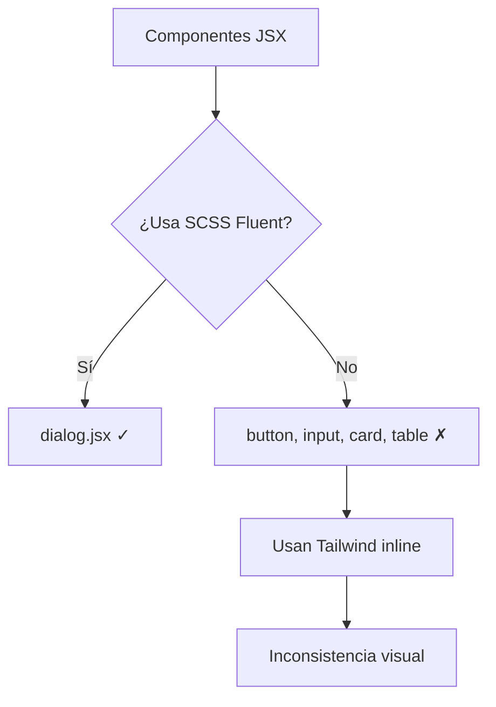

# Reporte de Auditoría - Componentes UI

**Fecha:** 2026-01-07  
**Objetivo:** Identificar inconsistencias en la implementación del sistema de diseño Fluent 2

---

## Hallazgo Principal

> [!CAUTION]
> El proyecto tiene **dos sistemas de estilos paralelos** que no están integrados.

### Sistema 1: SCSS Fluent 2 (Completo pero subutilizado)
| Archivo | Líneas | Contenido |
|:--|--:|:--|
| `_button.scss` | 395 | Variantes, tamaños, grupos, estados |
| `_input.scss` | 580 | Variantes, form-field, search input |
| `_modal.scss` | 332 | Tamaños, animaciones, alias dialog |
| `_card.scss` | ~200 | Variantes, elevación |
| `_data-table.scss` | 197 | Table estilos, action menu |

### Sistema 2: Tailwind/CVA (shadcn/ui) - En uso activo
| Componente | Líneas | Problema |
|:--|--:|:--|
| `button.jsx` | 56 | Usa CVA + clases Tailwind, ignora `_button.scss` |
| `input.jsx` | 25 | Usa clases Tailwind inline, ignora `_input.scss` |
| `card.jsx` | 102 | Usa clases Tailwind, ignora `_card.scss` |
| `table.jsx` | 122 | Usa clases Tailwind, ignora `_data-table.scss` |

### Componente Correctamente Integrado ✓
| Componente | Usa SCSS |
|:--|:--|
| `dialog.jsx` | ✓ Usa `radix-dialog__*` → `_radix-dialog.scss` |

---

## Diagnóstico



**Causa raíz:** La migración de Tailwind a SCSS creó los archivos SCSS pero no actualizó los componentes JSX para usarlos.

---

## Impacto

1. **Inconsistencia visual:** Componentes con Tailwind no respetan los tokens Fluent
2. **Duplicación:** Existen dos sistemas de variantes (CVA vs BEM/SCSS)
3. **Mantenimiento:** Cambios en tokens SCSS no afectan componentes Tailwind
4. **Theming:** Dark mode inconsistente entre sistemas

---

## Recomendación

Migrar componentes shadcn/ui para usar clases SCSS Fluent, siguiendo el patrón de `dialog.jsx`:

```diff
// button.jsx - Antes (Tailwind)
- className={cn("bg-primary text-primary-foreground...", className)}

// button.jsx - Después (SCSS Fluent)
+ className={cn("btn btn--primary", className)}
```

---

## Siguiente Fase

Crear inventario completo que mapee cada componente JSX con su archivo SCSS correspondiente para planificar la migración.
