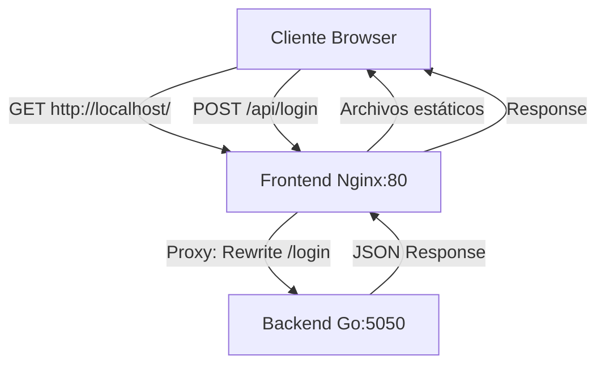

# 🚀 Guía de Despliegue - Frontend ERP

## 📋 Tabla de Contenidos

- [Estrategia de Configuración](#estrategia-de-configuración)
- [Archivos de Entorno](#archivos-de-entorno)
- [Construcción para Producción](#construcción-para-producción)
- [Despliegue con Docker](#despliegue-con-docker)
- [Integración con Backend](#integración-con-backend)
- [Troubleshooting](#troubleshooting)

---

## 🎯 Estrategia de Configuración

El frontend utiliza una configuración flexible basada en variables de entorno para adaptarse automáticamente a diferentes contextos:

### Entornos Soportados

| Entorno | API URL | Auto-Login | Uso |
|---------|---------|------------|-----|
| **Desarrollo** | `http://localhost:5050` | ✅ Habilitado | Desarrollo local |
| **Producción** | `/api` (proxy Nginx) | ❌ Deshabilitado | Docker/Producción |

### Arquitectura de Configuración

```
src/
├── config/
│   └── api.config.js          # Configuración centralizada
├── services/
│   ├── api.js                 # Servicio API principal
│   └── BusinessManagementAPI.js # Cliente API
```

---

## 📁 Archivos de Entorno

### `.env.development`

```bash
# =====================================
# CONFIGURACIÓN DE DESARROLLO
# =====================================

# API Backend - Desarrollo local
VITE_API_URL=http://localhost:5050

# Auto-login para desarrollo
VITE_AUTO_LOGIN=true

# Timeout de API (ms)
VITE_API_TIMEOUT=10000

# Modo de desarrollo
VITE_ENV=development
```

### `.env.production`

```bash
# =====================================
# CONFIGURACIÓN DE PRODUCCIÓN
# =====================================

# API Backend - Proxy de Nginx en Docker
# El proxy de Nginx redirige /api/* al backend:8080
VITE_API_URL=/api

# Desactivar auto-login en producción
VITE_AUTO_LOGIN=false

# Timeout de API más largo para producción (ms)
VITE_API_TIMEOUT=15000

# Modo de producción
VITE_ENV=production
```

### `.env.local` (opcional)

```bash
# Sobrescribe configuraciones locales sin afectar el repositorio
VITE_AUTO_LOGIN=true
```

---

## 🏗️ Construcción para Producción

### 1. Instalar dependencias

```bash
npm install
# o
pnpm install
```

### 2. Build de producción

```bash
npm run build
# o
pnpm build
```

El comando generará la carpeta `dist/` con los archivos optimizados.

### 3. Verificar el build localmente

```bash
npm run preview
# o
pnpm preview
```

Accede a `http://localhost:4173` para verificar el build.

---

## 🐳 Despliegue con Docker

### Estructura del Proyecto

```
erp-webapp/
├── Dockerfile              # Configuración Docker para producción
├── nginx.conf             # Configuración Nginx con proxy
├── .env.production        # Variables de entorno de producción
└── dist/                  # Build de producción (generado)
```

### Dockerfile

```dockerfile
# --- Stage 1: Build ---
FROM node:20-alpine AS builder

WORKDIR /app

# Copiar archivos de dependencias
COPY package*.json pnpm-lock.yaml ./

# Instalar pnpm y dependencias
RUN npm install -g pnpm && pnpm install

# Copiar código fuente
COPY . .

# Build de producción
RUN pnpm build

# --- Stage 2: Serve ---
FROM nginx:stable-alpine

# Copiar build desde el stage anterior
COPY --from=builder /app/dist /usr/share/nginx/html

# Copiar configuración de Nginx
COPY nginx.conf /etc/nginx/conf.d/default.conf

EXPOSE 80

CMD ["nginx", "-g", "daemon off;"]
```

### Configuración de Nginx (`nginx.conf`)

```nginx
server {
    listen 80;
    server_name localhost;
    root /usr/share/nginx/html;
    index index.html;

    # Servir archivos estáticos del frontend
    location / {
        try_files $uri $uri/ /index.html;
        
        # Headers para prevenir cache en producción
        add_header Cache-Control "no-cache, no-store, must-revalidate";
        add_header Pragma "no-cache";
        add_header Expires "0";
    }

    # Proxy para las peticiones a la API
    # Las peticiones a /api/* se redirigen al backend:5050
    location /api/ {
        # Remover /api del path antes de enviar al backend
        rewrite ^/api/(.*)$ /$1 break;
        
        # Proxy al backend en Docker Compose
        # IMPORTANTE: Este nombre 'backend' debe coincidir con el nombre del servicio en docker-compose.yml
        # El puerto 5050 debe coincidir con el puerto del backend
        proxy_pass http://backend:5050;
        
        proxy_http_version 1.1;
        proxy_set_header Upgrade $http_upgrade;
        proxy_set_header Connection 'upgrade';
        proxy_set_header Host $host;
        proxy_cache_bypass $http_upgrade;
        
        # Headers para preservar información del cliente
        proxy_set_header X-Real-IP $remote_addr;
        proxy_set_header X-Forwarded-For $proxy_add_x_forwarded_for;
        proxy_set_header X-Forwarded-Proto $scheme;
        
        # Timeouts aumentados para operaciones largas
        proxy_connect_timeout 60s;
        proxy_send_timeout 60s;
        proxy_read_timeout 60s;
        
        # Deshabilitar buffering para respuestas en tiempo real
        proxy_buffering off;
    }

    # Configuración de logs
    access_log /var/log/nginx/access.log;
    error_log /var/log/nginx/error.log;
}
```

---

## 🔗 Integración con Backend

### Docker Compose

Crea un archivo `docker-compose.yml` en el directorio del **backend**:

```yaml
version: '3.8'

services:
  # --- Backend (Go) ---
  backend:
    container_name: business_management_backend
    build:
      context: .
      dockerfile: Dockerfile
    ports:
      - "5050:5050"  # Puerto actualizado del backend
    environment:
      - DB_HOST=host.docker.internal
      - DB_PORT=5432
      - DB_USER=${DB_USER:-postgres}
      - DB_PASSWORD=${DB_PASSWORD:-mysecretpassword}
      - DB_NAME=${DB_NAME:-business_management_prod}
      - JWT_SECRET=${JWT_SECRET:-your-super-secret-key}
    extra_hosts:
      - "host.docker.internal:host-gateway"
    restart: unless-stopped
    networks:
      - erp-network

  # --- Frontend (Nginx) ---
  frontend:
    container_name: business_management_frontend
    build:
      context: ../erp-webapp  # Ruta al proyecto frontend
      dockerfile: Dockerfile
    ports:
      - "80:80"
    depends_on:
      - backend
    restart: unless-stopped
    networks:
      - erp-network

networks:
  erp-network:
    driver: bridge
```

### Flujo de Comunicación



**Descripción del flujo:**

1. Cliente solicita archivos estáticos → Nginx los sirve desde `/usr/share/nginx/html`
2. Cliente hace request a `/api/login` → Nginx reescribe a `/login` y redirige a `backend:5050`
3. Backend procesa y responde → Nginx devuelve la respuesta al cliente

### Comandos de Despliegue

```bash
# 1. Asegurar que PostgreSQL local esté corriendo
pg_ctl status

# 2. Ir al directorio del backend
cd /path/to/backend

# 3. Construir y levantar servicios
docker-compose up --build

# 4. Verificar contenedores
docker-compose ps

# 5. Ver logs
docker-compose logs -f frontend
docker-compose logs -f backend

# 6. Detener servicios
docker-compose down
```

---

## 🧪 Testing de la Configuración

### Test de Desarrollo

```bash
# 1. Asegurar que el backend esté corriendo en localhost:5050
curl http://localhost:5050/health

# 2. Iniciar frontend en modo desarrollo
npm run dev

# 3. Verificar en consola del navegador
# Deberías ver: "🔧 API Configuration: { baseUrl: 'http://localhost:5050', ... }"
```

### Test de Producción

```bash
# 1. Build de producción
npm run build

# 2. Levantar con Docker Compose
docker-compose up -d

# 3. Verificar endpoints
curl http://localhost/               # Frontend
curl http://localhost/api/health     # Backend (proxy)

# 4. Verificar logs de Nginx
docker-compose logs frontend | grep "proxy_pass"

# 5. Probar conectividad directa al backend desde el contenedor frontend
docker exec business_management_frontend wget -O- http://backend:5050/health
```

---

## 🔧 Troubleshooting

### Problema: Error de CORS

**Síntoma**: Errores de CORS en la consola del navegador

**Solución**:

1. Verificar que el backend incluya headers CORS apropiados
2. En desarrollo, asegurar que `VITE_API_URL` apunte al backend correcto
3. En producción, verificar que el proxy de Nginx esté configurado correctamente

### Problema: 502 Bad Gateway

**Síntoma**: Nginx retorna 502 al hacer peticiones a `/api/*`

**Causas posibles:**

1. Backend no está corriendo
2. Puerto incorrecto (debe ser 5050)
3. Nombre del servicio incorrecto en nginx.conf
4. Red Docker mal configurada

**Solución:**

```bash
# 1. Verificar que el backend esté corriendo
docker-compose ps backend

# 2. Verificar logs del backend
docker-compose logs backend | tail -50

# 3. Verificar logs de Nginx para ver errores de proxy
docker-compose logs frontend | grep -i error

# 4. Verificar conectividad de red entre contenedores
docker network inspect erp-network

# 5. Probar conectividad desde el contenedor del frontend al backend
docker exec business_management_frontend wget -O- http://backend:5050/health

# 6. Si todo falla, reiniciar servicios
docker-compose restart backend frontend

# 7. Si persiste, reconstruir completamente
docker-compose down
docker-compose up --build -d
```

### Problema: Variables de entorno no se aplican

**Síntoma**: La app usa configuración incorrecta

**Solución**:

```bash
# 1. Limpiar cache de Vite
npm run clean
rm -rf node_modules/.vite

# 2. Rebuild
npm run build

# 3. Verificar que el archivo .env.production exista
ls -la .env.production

# 4. Verificar en el build que las variables estén inyectadas
grep -r "VITE_API_URL" dist/
```

### Problema: Auto-login en producción

**Síntoma**: La app intenta auto-login en producción

**Solución**:

```bash
# Verificar .env.production
cat .env.production | grep VITE_AUTO_LOGIN
# Debe ser: VITE_AUTO_LOGIN=false

# Rebuild
npm run build
```

---

## 📊 Checklist de Despliegue

### Antes del Deploy

- [ ] Variables de entorno configuradas correctamente (`.env.production`)
- [ ] `VITE_API_URL=/api` en producción
- [ ] `VITE_AUTO_LOGIN=false` en producción
- [ ] Build de producción generado (`npm run build`)
- [ ] Carpeta `dist/` existe y contiene archivos

### Configuración Docker

- [ ] `Dockerfile` actualizado y probado localmente
- [ ] `nginx.conf` configurado con proxy a `backend:5050`
- [ ] `docker-compose.yml` con servicios frontend y backend
- [ ] Red `erp-network` configurada en docker-compose
- [ ] Puertos mapeados correctamente (80:80 frontend, 5050:5050 backend)

### Backend y Base de Datos

- [ ] PostgreSQL corriendo y accesible
- [ ] Backend corriendo y respondiendo en puerto 5050
- [ ] Endpoint `/health` del backend funcional
- [ ] Variables de entorno del backend configuradas
- [ ] Migraciones de DB ejecutadas

### Seguridad y Configuración

- [ ] Auto-login deshabilitado en producción
- [ ] CORS configurado correctamente en backend
- [ ] Timeouts configurados apropiadamente (60s)
- [ ] Headers de seguridad configurados en Nginx
- [ ] Logs de Nginx accesibles
- [ ] Logs de debug deshabilitados en frontend

### Testing

- [ ] Tests de endpoints funcionando
- [ ] Prueba de proxy `/api/*` exitosa
- [ ] Conectividad entre contenedores verificada
- [ ] Health checks pasando
- [ ] Funcionalidad de login testeada
- [ ] Scripts de validación ejecutados (`./validate-config.sh`)

---

## 🔒 Seguridad en Producción

### Recomendaciones

1. **Nunca commitear archivos `.env` con credenciales reales**
2. **Usar secrets de Docker o variables de entorno del sistema**
3. **Habilitar HTTPS en producción** (Nginx + Let's Encrypt)
4. **Configurar rate limiting en Nginx**
5. **Deshabilitar logs de debug en producción**

### Ejemplo con HTTPS (futuro)

```nginx
server {
    listen 443 ssl http2;
    server_name tu-dominio.com;
    
    ssl_certificate /etc/ssl/certs/cert.pem;
    ssl_certificate_key /etc/ssl/private/key.pem;
    
    # ... resto de la configuración
}
```

---

## 🤖 Scripts de Automatización

Para facilitar el proceso de deployment, se han creado scripts de automatización:

### validate-config.sh

Valida toda la configuración antes del deploy:

```bash
./validate-config.sh
```

**Qué valida:**

- ✅ Archivos `.env` existen y están configurados
- ✅ `VITE_API_URL` tiene valores correctos según entorno
- ✅ `VITE_AUTO_LOGIN` está deshabilitado en producción
- ✅ Archivos Docker (`Dockerfile`, `docker-compose.yml`, `nginx.conf`) existen
- ✅ Estructura de carpetas necesarias

**Ejemplo de salida:**

```text
🔍 Validando configuración del proyecto...

✅ .env.development encontrado
✅ .env.production encontrado
✅ VITE_API_URL en development: http://localhost:5050
✅ VITE_API_URL en production: /api
✅ AUTO_LOGIN deshabilitado en production

✅ Todos los archivos de configuración están correctos
```

### build-and-deploy.sh

Automatiza el proceso completo de build y deploy:

```bash
./build-and-deploy.sh
```

**Pasos que ejecuta:**

1. **Validación**: Ejecuta `validate-config.sh`
2. **Limpieza**: Elimina builds anteriores
3. **Instalación**: Instala/actualiza dependencias
4. **Build**: Genera el build de producción
5. **Verificación**: Valida que el build sea correcto
6. **Docker Build**: Construye la imagen Docker
7. **Deploy**: Levanta los servicios con docker-compose

**Ejemplo de uso:**

```bash
# 1. Dar permisos de ejecución (solo la primera vez)
chmod +x ./build-and-deploy.sh

# 2. Ejecutar el script
./build-and-deploy.sh

# El script te guiará paso a paso y mostrará:
# - Estado de cada paso
# - Comandos sugeridos
# - Verificaciones de salud
```

### Integración con CI/CD

Estos scripts pueden integrarse fácilmente en pipelines de CI/CD:

```yaml
# Ejemplo: GitHub Actions
name: Deploy Frontend

on:
  push:
    branches: [main]

jobs:
  deploy:
    runs-on: ubuntu-latest
    steps:
      - uses: actions/checkout@v3
      
      - name: Validar configuración
        run: ./validate-config.sh
      
      - name: Build y Deploy
        run: ./build-and-deploy.sh
```

---

## 📞 Soporte

Para problemas o dudas:

1. **Validar configuración**: Ejecutar `./validate-config.sh`
2. **Revisar logs**: `docker-compose logs -f frontend` y `docker-compose logs -f backend`
3. **Verificar configuración de Docker**: `docker-compose config`
4. **Consultar documentación del backend**: Ver `DEPLOY_STRATEGY.md` en el repositorio del backend
5. **Verificar conectividad**: Usar los comandos de troubleshooting de esta guía

### Documentación Relacionada

- [Estrategia de Deployment del Backend](./DEPLOY_STRATEGY.md) (si existe)
- [Variables de Entorno](../../.env.example)
- [Configuración de Nginx](../../nginx.conf)
- [Docker Compose](../../docker-compose.yml)
- [Guía de Features](./FEATURE_CONTRIBUTION_GUIDE.md)

### Scripts de Utilidad

- `./validate-config.sh` - Valida toda la configuración antes del deploy
- `./build-and-deploy.sh` - Automatiza el proceso completo de deployment
- `./verify-setup.sh` - Verifica la instalación y configuración del proyecto (si existe)

---

**Última actualización**: Diciembre 2024  
**Versión del documento**: 2.0.0  

**Cambios en v2.0.0**:

- ✅ Actualizado puerto del backend: 8080 → 5050
- ✅ Agregados scripts de automatización (validate-config.sh, build-and-deploy.sh)
- ✅ Mejorada sección de troubleshooting con comandos específicos
- ✅ Ampliado checklist de deployment con categorías
- ✅ Agregadas pruebas de conectividad entre contenedores
